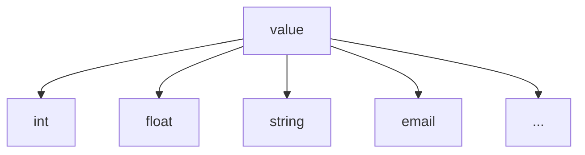

# 假資料結構產生器

- [假資料結構產生器](#假資料結構產生器)
  - [Wrapping fakerjs Functions](#wrapping-fakerjs-functions)
  - [用途](#用途)
    - [createValueGenerator](#createvaluegenerator)
    - [createSelectionGenerator](#createselectiongenerator)
    - [createObjectGenerator](#createobjectgenerator)
    - [createArrayGenerator](#createarraygenerator)
    - [createTupleGenerator](#createtuplegenerator)
    - [createBoundedSeriesGenerator](#createboundedseriesgenerator)
  - [擴充](#擴充)

## Wrapping fakerjs Functions

- [X] Airline
- [X] Animal
- [X] Color
- [X] Commerce
- [X] Company
- [X] Database
- [X] Datatype
- [X] Date(Datetime)
- [X] Finance
- [ ] Food
- [ ] Git
- [ ] Hacker
- [ ] Image
- [ ] Internet
- [ ] Location
- [X] Lorem
- [ ] Music
- [X] Number
- [X] Person
- [X] Phone
- [ ] Science
- [X] String
- [ ] System
- [ ] Vehicle

## 用途

使用 faker js 時是單一純值不能產生結構，需要自己手動組合結構，此專案利用撰寫設定檔的方式來產生一個特定的假資料函數，減少手動組合結構的麻煩。

```javascript
const test = {
  type: 'obj',
  content: {
    name: {
      type: 'value',
      generateFn: () => 'hello',
    },
    list: {
      type: 'arr',
      len: 5,
      item: {
        type: 'value',
        generateFn: () => 10,
      },
    },
  },
};

const generateFn = createGeneratorByType(test);

console.log(generateFn());

/*
{
  name: "hello"
  list: [10, 10, 10, 10, 10,]
}
*/
```


### createValueGenerator

```javascript
const generateFn = createValueGenerator({
  type: 'value',
  generateFn: () => 10,
})

console.log(generateFn());

// 10
```

### createSelectionGenerator

```javascript
const generateFn = createSelectionGenerator({
 type: 'select',
 items: [1, 2, 3, 4, 5],
})

console.log(generateFn());

// 1 or 2 or 3 or 4 or 5
```

### createObjectGenerator

```javascript
const generateFn = createObjectGenerator({
 type: 'obj',
 content: {
   name: {
     type: 'value',
     generateFn: () => 'hello',
   },
   list: {
     type: 'arr',
     len: 5,
     item: {
       type: 'value',
       generateFn: () => 10,
     }
   }
 }
})

console.log(generateFn());

// {
//   name: 'hello',
//   list: [10, 10, 10, 10, 10]
// }
```
### createArrayGenerator


```javascript
const generateFn = createArrayGenerator({
 type: 'arr',
 len: 5,
 item: {
   type: 'value',
   generateFn: () => 10,
 }
})

console.log(generateFn());

// [10, 10, 10, 10, 10]
```

### createTupleGenerator

```javascript
const generateFn = createTupleGenerator({
 type: 'tuple',
 configItems: [
   {
     type: 'value',
     generateFn: () => 10,
   },
   {
     type: 'value',
     generateFn: () => 'hello',
   },
 ]
})

console.log(generateFn());

// [10, 'hello']
```

### createBoundedSeriesGenerator

```javascript
const generateFn = createBoundedSeriesGenerator({
 type: 'bounded_series',
 upperLimit: 1.1,
 lowerLimit: 0.9,
 createInitValue: () => 100,
 count: 20
})

console.log(generateFn());

// [100 * 0.9 <= num <= 100 * 1.1, 
//  prev * 0.9 <= num <= prev * 1.1,
//  prev * 0.9 <= num <= prev * 1.1,
//  ...] 
```

## 擴充

一切的值皆由 `value` 產生，可以自己創建各種不同亂數函數



但並不是所有人情況都能自己手動建立函數，有可能是開放給別人使用的服務，沒辦法在使用方建立函數，這時 `createGeneratorByType` 第二個可以讓製作服務的人帶入自己的擴充，這樣這個函數就能接受更多種型態。

```javascript
const createIntValueConfig = (option) => createValueConfig(() => faker.number.int(option));
const createEmailValueConfig = (option) => createValueConfig(() => faker.internet.email(option));

const customTypeMatch = (config) => {
  if (config.type === "int") {
    return createIntValueConfig(config.option);
  }
  if (config.type === "email") {
    return createEmailValueConfig(config.option);
  }

  throw Error("error");
};

const config = {
  type: "obj",
  content: {
    name: { type: "value", generateFn: () => "John" },
    age: { type: "int" },
    email: { type: "email" },
  },
};

const result = createGeneratorByType(config, customTypeMatch)();

console.log(result);

/*
  {
    name: "John",
    age: 50,
    email: "xxx@example.com",
  }
*/
```

