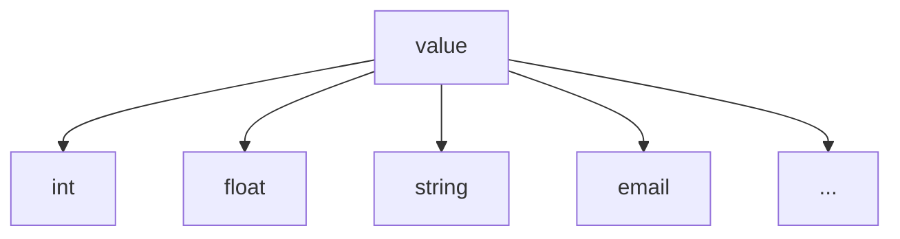

# 假資料結構產生器

- [假資料結構產生器](#假資料結構產生器)
  - [Wrapping fakerjs Functions](#wrapping-fakerjs-functions)
  - [用途](#用途)
    - [Value](#value)
    - [Selection](#selection)
    - [Object](#object)
    - [createArrayGenerator](#createarraygenerator)
    - [createTupleGenerator](#createtuplegenerator)
    - [BoundedSeries](#boundedseries)
  - [擴充](#擴充)

## Wrapping fakerjs Functions

- [X] Airline
- [X] Animal
- [X] Color
- [X] Commerce
- [X] Company
- [X] Database
- [X] Datatype
- [X] Date(Datetime)
- [X] Finance
- [X] Food
- [X] Git
- [X] Hacker
- [X] Image
- [X] Internet
- [X] Location
- [X] Lorem
- [X] Music
- [X] Number
- [X] Person
- [X] Phone
- [X] Science
- [X] String
- [X] System
- [X] Vehicle

## 用途

使用 faker js 時是單一純值不能產生結構，需要自己手動組合結構，此專案利用撰寫設定檔的方式來產生一個特定的假資料函數，減少手動組合結構的麻煩。

```typescript
import { StructConfig } from 'struct-fakerator'

const scheme = StructConfig.object({
  name: StructConfig.value(() => 'hello'),
  enum: StructConfig.select([1, 2, 3]),
  list: StructConfig.array(StructConfig.value(() => 10), 5),
  tuple: StructConfig.tuple([StructConfig.value(() => 'tuple1'), StructConfig.value(() => '100')])
})

// or
import {
  createObjectConfig,
  createArrayConfig,
  createValueConfig,
  createTupleConfig,
  createSelectionConfig
} from 'struct-fakerator';


const scheme = createObjectConfig({
  name: createValueConfig(() => 'hello'),
  enum: createSelectionConfig([1, 2, 3]),
  list: createArrayConfig(
    createValueConfig(() => 10),
    5
  ),
  tuple: createTupleConfig([
    createValueConfig(() => 'tuple1'),
    createValueConfig(() => 100),
    createValueConfig(() => false),
  ])
});

// or
const scheme = {
  type: 'obj',
  content: {
    name: {
      type: 'value',
      generateFn: () => 'hello',
    },
    enum: {
      type: 'select',
      items: [1, 2, 3],
    },
    list: {
      type: 'arr',
      item: {
        type: 'value',
        generateFn: () => 10,
      },
      len: 5,
    },
    tuple: {
      type: 'tuple',
      configItems: [
        {
          type: 'value',
          generateFn: () => 'tuple1',
        },
        {
          type: 'value',
          generateFn: () => 100,
        },
        {
          type: 'value',
          generateFn: () => false,
        },
      ],
    },
  },
};
```

```typescript
import { StructGenerator } from 'struct-fakerator';

const result = StructGenerator.genFn(scheme)()

console.log(result);
// {
//   name: 'hello',
//   enum: 1, // or 2 or 3
//   list: [10, 10, 10, 10, 10],
//   tuple: ['tuple1', 100, false]
// }

```


### Value

```typescript
const generateFn = StructGenerator.genFn(StructConfig.value(() => 10));

console.log(generateFn());
// 10
```

### Selection

```javascript
const generateFn = StructGenerator.genFn(StructConfig.select([1, 2, 3, 4, 5]))

console.log(generateFn());
// 1 or 2 or 3 or 4 or 5
```

### Object

```typescript
const generateFn = StructGenerator.genFn(StructConfig.object({
  name: StructConfig.value(() => 'hello'),
  list: StructConfig.array(StructConfig.value(() => 10), 5),
}));

console.log(generateFn());
// {
//   name: 'hello',
//   list: [10, 10, 10, 10, 10]
// }

// with transformer function
const generateFn = StructGenerator.genFn(
  StructConfig.object(
    {
      name: StructConfig.value(() => 'hello'),
      list: StructConfig.array(
        StructConfig.value(() => 10),
        5
      ),
    },
    ({ name, list }) => list.map((item) => `${name} ${item}`)
  )
);

console.log(generateFn());
// ["hello 10", "hello 10", "hello 10", "hello 10", "hello 10"]
```

### createArrayGenerator

```typescript
const generateFn = StructGenerator.genFn(
  StructConfig.array(
    StructConfig.value(() => 10),
    5
  )
);

console.log(generateFn());
// [10, 10, 10, 10, 10]

// with next function
const generateFn = StructGenerator.genFn(
  StructConfig.array(
    StructConfig.value(() => 10),
    5,
    (prev, current) => prev + 1 + current
  )
);

console.log(generateFn());
// [21, 32, 43, 54, 65]
```

### createTupleGenerator

```typescript
const generateFn = StructGenerator.genFn(
  StructConfig.tuple([
    StructConfig.value(() => 'tuple1'),
    StructConfig.value(() => 100),
    StructConfig.value(() => false),
  ])
);

console.log(generateFn());
// ['tuple1', 100, false]
```

### BoundedSeries

```javascript
const generateFn = StructGenerator.genFn(
  StructConfig.boundedSeries({
    upperLimit: 1.1,
    lowerLimit: 0.9,
    createInitValue: () => 100,
    count: 20,
  })
);

console.log(generateFn());
// [100 * 0.9 <= num <= 100 * 1.1, 
//  prev * 0.9 <= num <= prev * 1.1,
//  prev * 0.9 <= num <= prev * 1.1,
//  ...] 
```

## 擴充

一切的值皆由 `value` 產生，可以自己創建各種不同亂數函數



但並不是所有人情況都能自己手動建立函數，有可能是開放給別人使用的服務，沒辦法在使用方建立函數，這時 `createGeneratorByType` 第二個可以讓製作服務的人帶入自己的擴充，這樣這個函數就能接受更多種型態。

```javascript
const createIntValueConfig = (option) => createValueConfig(() => faker.number.int(option));
const createEmailValueConfig = (option) => createValueConfig(() => faker.internet.email(option));

const customTypeMatch = (config) => {
  if (config.type === "int") {
    return createIntValueConfig(config.option);
  }
  if (config.type === "email") {
    return createEmailValueConfig(config.option);
  }

  throw Error("error");
};

const config = {
  type: "obj",
  content: {
    name: { type: "value", generateFn: () => "John" },
    age: { type: "int" },
    email: { type: "email" },
  },
};

const result = createGeneratorByType(config, customTypeMatch)();

console.log(result);

/*
  {
    name: "John",
    age: 50,
    email: "xxx@example.com",
  }
*/
```

